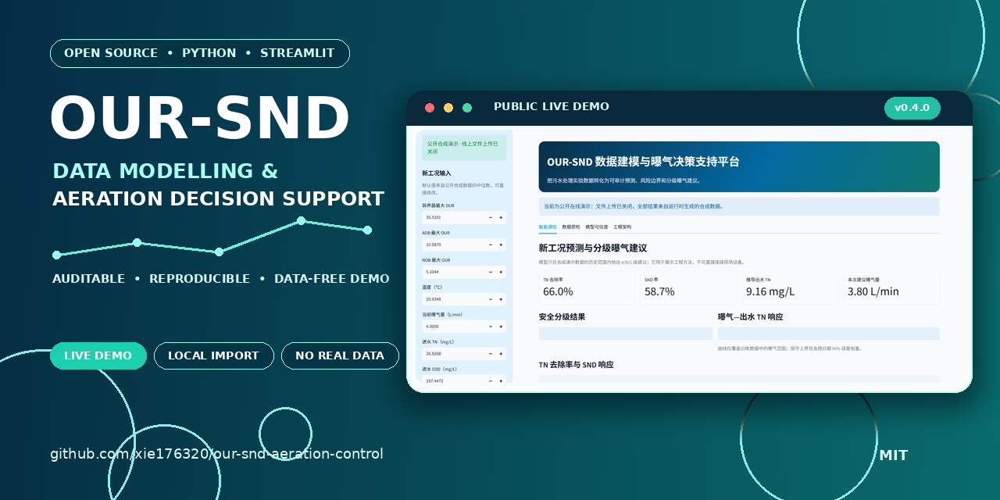
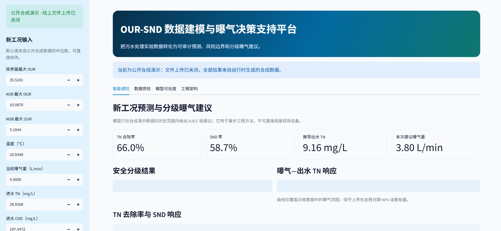
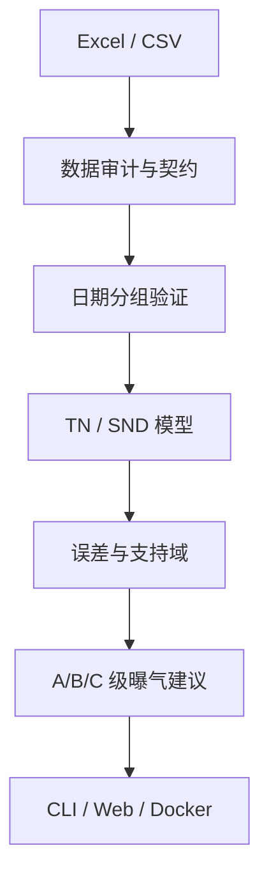

<p align="center">
  
</p>

# OUR-SND 数据建模与曝气决策支持平台

[](https://github.com/xie176320/our-snd-aeration-control/actions/workflows/ci.yml)
[](https://www.python.org/)
[](https://github.com/xie176320/our-snd-aeration-control/releases)
[](LICENSE)
[](https://our-snd-aeration-control.streamlit.app/)

> 开源项目主题：**面向污水生化处理的 OUR-SND 数据建模与曝气决策支持**

一套面向污水处理实验数据的 Python 工程：从 Excel/CSV 数据审计、按日期无泄漏验证、TN/SND 双目标预测，到带不确定性和安全边界的分级曝气建议，并提供 CLI、交互式网页、Docker、Codespaces 与 GitHub Actions。

_A reproducible research and decision-support toolkit for OUR-informed SND modelling and safety-graded aeration recommendations._

**[▶ 打开公开在线演示](https://our-snd-aeration-control.streamlit.app/)** — 无需安装、无需上传文件；演示仅使用运行时生成的合成数据。

[](https://our-snd-aeration-control.streamlit.app/)

<p align="center"><sub>公开部署使用运行时合成数据，线上文件上传入口已关闭。点击截图进入在线演示。</sub></p>

## 为什么做这个项目

传统 DO 或定时曝气很难同时表达微生物活性、脱氮状态和运行风险。实验数据又常具有“同一天多组重复、跨日期差异大、字段来源分散”的特点，随机记录拆分会明显高估模型泛化能力。

本项目把研究问题拆成一条可审计链路：

1. 原始工作簿能否可靠整理成模型数据；
2. OUR 是否能在完全未见日期上解释 TN 去除率与 SND 率；
3. 当前工况是否仍位于历史支持域；
4. 在出水 TN 限值与误差裕量下，应正式优化、小步试运行还是维持曝气。

## 系统架构



| 能力 | 实现 |
| --- | --- |
| 数据治理 | 四类工作簿解析、来源行追踪、缺失/越界审计、同日精确连接 |
| 可信验证 | 固定日期 5 折、重复日期 5 折、留一日期、滚动时间验证 |
| 模型研究 | PLS、Ridge、SVR 集成、TN-SND 联合模型、实时 OUR 特征消融 |
| 限定校准 | 新日期低/中/高三个曝气实测点校准，只在当日范围内插值 |
| 安全决策 | 90% 误差裕量、最近邻支持域、原始范围、剂量效应门控 |
| 工程交付 | 命令行、Streamlit、Docker、Codespaces、CI 和自动测试 |

详细设计见 [系统架构与技术方案](docs/architecture.md)。

## 两种隔离运行模式

| 模式 | 如何启用 | CSV 上传 | 数据位置 |
| --- | --- | --- | --- |
| 公开在线演示（默认） | 直接启动或部署 `main` | **关闭，界面中没有上传控件** | 只使用运行时生成的合成数据 |
| 一键本地导入 | `start_local` 脚本或 Docker Compose | 仅本地开放 | CSV 与模型只在本机进程内存中 |

本地导入采用双开关保护：只有 `SND_APP_MODE=local` 与
`SND_LOCAL_IMPORT=1` 同时存在才会显示文件选择器。少一个、拼错或未设置都会
回退为公开合成演示。请勿在任何公开服务器上开启这两个开关。

## 立即运行

### 方式一：公开在线演示（无需安装）

访问 **[our-snd-aeration-control.streamlit.app](https://our-snd-aeration-control.streamlit.app/)**。
公开部署固定使用合成数据，线上没有文件上传入口，也不读取或保存真实实验数据。

### 方式二：GitHub Codespaces

在仓库中选择 **Code → Codespaces → Create codespace**，然后运行：

```bash
bash scripts/run_demo.sh
streamlit run streamlit_app.py
```

Codespaces 中默认仍是公开合成演示，不提供文件上传。

### 方式三：一键本地导入（推荐）

先克隆项目，然后运行对应入口；脚本会自动建立 `.venv`、安装缺少的依赖、
打开 `http://127.0.0.1:8501`，不需要手工设置环境变量。

macOS / Linux：

```bash
git clone https://github.com/xie176320/our-snd-aeration-control.git
cd our-snd-aeration-control
bash scripts/start_local.sh
```

Windows：克隆或下载 ZIP 后，双击 `scripts\start_local.cmd`。也可以在终端运行：

```bat
scripts\start_local.cmd
```

左侧选择符合数据契约的 CSV。文件先通过字段、范围、40 条有效记录与 5 个
日期/批次闸门；通过后才在本地建立模型并替换合成演示模型。

### 方式四：Docker 一条命令本地导入

```bash
docker compose up --build
```

Compose 只绑定 `127.0.0.1:8501` 并显式启用本地导入。直接运行 Docker 镜像时
仍默认是关闭上传的公开模式。

完整部署说明见 [部署与运行手册](docs/deployment.md)。

## 5 分钟命令行验收

即使没有安装 `snd-control` 命令，一键脚本也会自动回退到模块入口：

```bash
bash scripts/run_demo.sh outputs/demo
```

或逐步运行：

```bash
snd-control demo-data --output outputs/demo/demo_model_input.csv
snd-control validate --data outputs/demo/demo_model_input.csv
snd-control train --data outputs/demo/demo_model_input.csv --output-dir outputs/demo-model
snd-control predict \
  --model outputs/demo-model/model_bundle.joblib \
  --condition configs/prediction_condition.example.json
```

演示 CSV 由固定随机种子的生成器在 `outputs/` 中即时创建，不随仓库发布，
只用于测试和界面演示，不得用于论文结论或现场控制。

## 公开证据与私有数据边界

公开仓库只发布代码、数据契约、测试和确定性合成生成器。它不包含任何真实
实验记录、工作簿名、日期范围、文件哈希、逐批统计量、训练模型或由私有数据
计算的成绩。这样既能完整复现实验方法，也不会把闭源研究资产变相公开。

CI 会在每次 Pull Request 中重新生成虚构数据，并验证：

- 同一日期不会跨训练集和验证集；
- 数据质量闸门、预测边界和三点校准接口可运行；
- Streamlit 健康检查和 Docker 构建通过；
- 合成指标只证明软件链路可复现，不代表真实现场性能。

真实数据评价必须在授权的本地环境重新运行，并把结果保存在被 Git 忽略的
`outputs/` 中；网页本地导入只在内存中处理 CSV，不生成或提交数据文件。
方法边界见 [同日三点校准](docs/calibrated_model.md)。

## 标准数据契约

运行 `snd-control schema` 可查看完整定义。V4 的 11 个必需字段为：

| 字段 | 规则 |
| --- | --- |
| `日期` | 同一日期/批次必须进入同一个验证折 |
| `异养菌最大OUR`、`AOB最大OUR`、`NOB最大OUR` | mgO₂/(L·h)，≥0 |
| `异养菌实时OUR` | mgO₂/(L·h)，≥0 |
| `温度（摄氏度）` | 数值 |
| `曝气量(L/min)` | >0 |
| `进水TN(mg/L)` | >0 |
| `进水COD(mg/L)` | ≥0 |
| `TN去除率`、`SND率` | 0–1，而不是 0–100 |

建议额外保留 AOB/NOB 实时 OUR 和独立实测出水 TN。由去除率推导的出水 TN 只是代理值，不能替代独立实测评价。

## 分级曝气决策

| 等级 | 证据 | 系统动作 |
| --- | --- | --- |
| A | 剂量效应、支持域和保守 TN 上界均通过 | 给稳态目标，但每次只允许有限步长 |
| B | 有安全余量但证据不足 | 只降/调一个小步，稳定 1 个 HRT 后复测 |
| C | 外推或安全余量不足 | 明确输出“维持当前曝气量” |

程序每次都会给出一个数值建议，但不会把证据不足的数学最小值包装成现场最优值。默认出水 TN 限值为 15 mg/L，可通过命令参数修改。

## 目录结构

```text
.
├── .github/                 # CI、Issue 和 PR 模板、依赖更新
├── .streamlit/              # 网页主题与安全配置
├── configs/                 # 不含凭据的工况与三点校准示例
├── data/sample/             # 合成数据格式与生成说明（不存放记录）
├── docs/                    # 架构、模型、部署和作品集文档
├── scripts/                 # 一键本地网页、合成演示与私有数据离线入口
├── src/wastewater_snd/      # 数据、建模、决策、CLI 与网页代码
├── tests/                   # 泄漏、校准、质量和预测测试
├── Dockerfile
├── docker-compose.yml
└── streamlit_app.py
```

## 文档

- [系统架构与技术方案](docs/architecture.md)
- [数据字典](docs/data_dictionary.md)
- [详细运行手册](docs/running.md)
- [部署与运行手册](docs/deployment.md)
- [v0.4.0 发布说明](docs/releases/v0.4.0.md)
- [校招作品集使用指南](docs/portfolio_guide.md)
- [贡献指南](CONTRIBUTING.md)与[安全策略](SECURITY.md)

## 免责声明

本项目是科研与教学用途的决策支持原型，不是经认证的工业控制系统。任何现场试运行都必须由专业人员审核，并配置独立水质监测、人工确认、安全联锁和故障回退。

## 许可证与引用

代码按 [MIT License](LICENSE) 开源。学术使用可参考 [CITATION.cff](CITATION.cff)。
