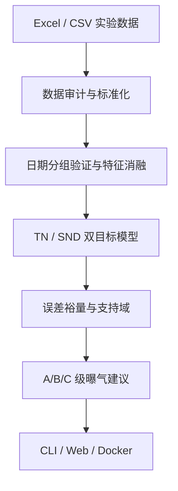
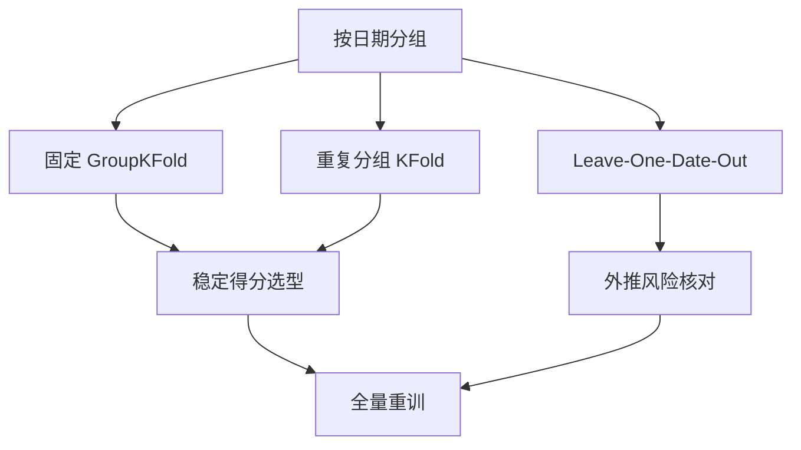

# 系统架构与技术方案

## 1. 目标

本项目把“基于耗氧速率的污水处理同步硝化反硝化智能调控研究”落成一套可运行、可审计的软件原型。它解决四个连续问题：数据能否使用、模型是否真正跨日期泛化、当前工况能否安全外推、曝气量应如何分步调整。

## 2. 总体架构

## 3. 分层设计

| 层 | 主要模块 | 职责 | 关键约束 |
| --- | --- | --- | --- |
| 数据接入 | `sources.py` | 解析四类工作簿、统一日期与样品语义 | 原文件只读、保留来源行号 |
| 数据契约 | `schema.py` | 定义必需字段、单位、范围和质量问题 | 缺失/越界行逐条审计 |
| 建模 | `model_v4.py` | 特征构造、候选模型、分组验证、模型包 | 同一日期不能跨训练/验证折 |
| 校准 | `calibrated.py` | 同日低/中/高三点残差校准 | 只允许校准区间内插值 |
| 消融 | `ablation.py` | 比较最大 OUR 与实时 OUR 组合 | 使用完全相同的日期划分 |
| 决策 | `model_v4.py` | 误差裕量、支持域、剂量效应门控 | 始终输出数值，但不越权宣称最优 |
| 交互 | `cli.py`, `dashboard.py` | 命令行、上传质检、预测与曲线 | 公共网页不保存上传数据 |
| 交付 | Docker, Actions, Codespaces | 环境复现、自动测试、容器部署 | 只携带合成样例 |

## 4. 关键数据流

### 4.1 数据审计

1. 读取原始 Excel/CSV 并计算文件哈希。
2. 规范日期、J/C 标签、重复号和 OUR 指标名称。
3. 只在同日精确连接水质与 OUR，拒绝跨日近似匹配。
4. 输出训练草稿、待补模板、质量问题和逐行排除依据。
5. 只有有效记录不少于 40 条且日期组不少于 5 个，才允许进入 V4。

### 4.2 模型验证

随机记录拆分可能把同一天的相似样本同时放进训练集和验证集，从而高估 R²。本项目把日期/批次作为不可拆分的最小验证单元。

### 4.3 决策边界

| 等级 | 条件 | 输出动作 |
| --- | --- | --- |
| A | 剂量效应门控通过，联合支持域通过，90% 保守 TN 上界达标 | 给出稳态目标，并限制单次调节幅度 |
| B | 证据不足但单变量范围与当前安全余量允许 | 只给一个小步试运行值，稳定 1 个 HRT 后复测 |
| C | 外推、余量不足或局部方向不清 | 给出明确的“维持当前曝气”数值 |

## 5. 为什么采用双入口

- **CLI** 适合可复现实验、批处理、服务器运行与论文结果留痕。
- **Streamlit** 适合校招演示、非程序用户交互与快速查看模型边界。
- 两者复用同一 `model_v4` 和 `demo_runtime`，避免出现网页与命令行算法不一致。

## 6. 生产化仍需补齐

当前版本不直接控制现场设备。若升级为生产系统，还需要：实时传感器校准、独立未来月份验证、权限与审计、设备通信协议、异常检测、人工确认、故障回退，以及经现场负责人批准的安全联锁。
