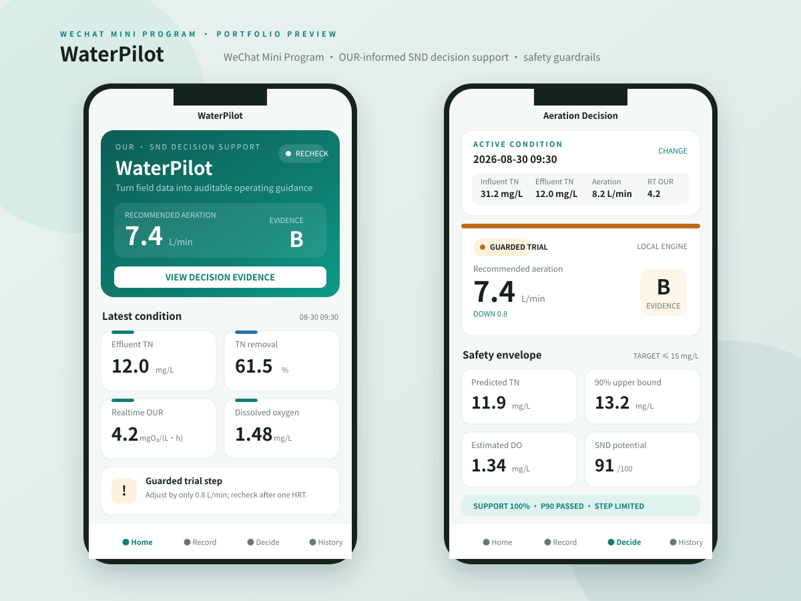
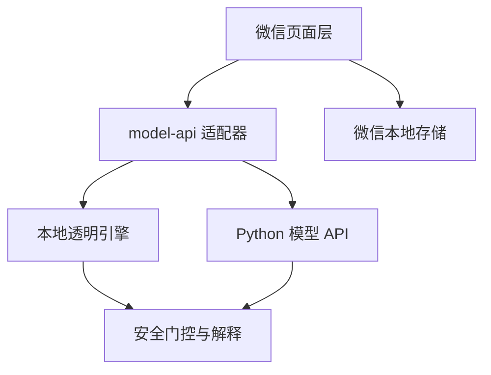

# WaterPilot 智水云控

> 面向污水生化处理实验与现场巡检的 OUR-SND 决策支持微信小程序。



WaterPilot 把“工况采集—字段校验—模型计算—安全门控—历史复盘”做成一个可在手机端演示的完整产品闭环。它是 [`our-snd-aeration-control`](https://github.com/xie176320/our-snd-aeration-control) 的移动端产品化延伸，重点展示环境工程知识、数据产品思维和软件工程能力如何组合解决实际问题。

## 为什么这个项目适合写进校招简历

普通课程小程序往往只展示增删改查。WaterPilot 有清晰的真实业务问题和技术取舍：

- **专业辨识度**：围绕 TN、DO、MLSS、OUR 和 SND，而不是通用打卡或商城模板；
- **完整业务闭环**：现场录入、量纲与范围校验、决策计算、风险解释、历史筛选和 CSV 导出；
- **可信决策意识**：同时检查 90% 保守 TN 上界、DO 参考窗口、历史支持域、混合安全下限和单次调节步长；
- **工程能力**：页面、存储、模型适配器与纯领域引擎解耦，核心逻辑可在 Node.js 中独立测试；
- **隐私边界**：默认离线运行，不上传真实实验数据；公开仓库只含虚构演示数据。

## 功能

| 模块 | 能力 |
| --- | --- |
| 首页驾驶舱 | 最新工况、TN 去除率、OUR/DO 指标、风险提示与 7 次趋势 |
| 工况录入 | 水质、运行条件、异养菌/AOB/NOB 最大 OUR 与实时 OUR 表单 |
| 曝气决策 | A/B/C 证据分级、保守上界、支持域、SND 潜力和执行清单 |
| 历史记录 | 达标筛选、记录复算、删除、演示数据恢复与 CSV 复制 |
| 双引擎适配 | 默认本地透明引擎；配置后可切换 Python 模型 API |

## 架构



```text
miniprogram/
├── components/              # 指标卡、状态标签、轻量趋势图
├── config/                  # 演示/远程模式和安全默认值
├── data/                    # 运行时生成的虚构演示数据
├── pages/                   # 首页、录入、决策、历史、关于
├── services/
│   ├── decision-engine.js   # 无框架依赖的纯领域逻辑
│   ├── model-api.js         # 本地/远程模型统一适配层
│   └── storage.js           # 本地记录与 CSV 导出
├── tests/                   # Node.js 单元测试
├── preview/                 # 无开发者工具时的静态视觉预览
├── app.js / app.json / app.wxss
└── project.config.json
```

## 立即运行

1. 安装[微信开发者工具](https://developers.weixin.qq.com/miniprogram/dev/devtools/download.html)；
2. 克隆仓库，选择“导入项目”；
3. 项目目录选择仓库中的 `miniprogram/`；
4. 没有小程序 AppID 时使用测试号或工具提供的游客模式；
5. 编译后会自动生成 7 天虚构演示数据，无需服务器即可体验全部页面。

本地工程校验：

```bash
cd miniprogram
npm run check
```

项目运行时零第三方依赖；测试使用 Node.js 内置 `node:test`。

## 接入现有 Python 模型

默认配置位于 `config/index.js`：

```js
module.exports = {
  demoMode: true,
  apiBaseUrl: ''
}
```

将 `demoMode` 改为 `false` 并配置已备案、已加入小程序 request 合法域名的 HTTPS 服务，即可由 `services/model-api.js` 调用：

```http
POST /v1/recommendations
Content-Type: application/json

{
  "condition": { "influentTN": 31.2, "currentAeration": 8.2, "...": "..." },
  "target_tn": 15,
  "minimum_safe_aeration": 3.8
}
```

生产接口必须返回与 `decision-engine.js` 的 `recommendAeration()` 一致的结果字段。远程服务还应补齐身份鉴权、请求签名、速率限制、审计日志、超时回退和模型版本记录。

## 决策逻辑边界

仓库中的 `transparent-demo-v1` 是确定性的透明规则引擎，用于证明产品链路和安全门控可以运行。它不会读取任何真实实验数据，也不能证明现场预测精度。

正式接入时应至少完成：

1. 在授权环境使用真实数据重新训练；
2. 按日期/批次隔离验证，避免同日重复样本泄漏；
3. 用独立实测出水 TN 评价，而不是只用去除率反推；
4. 校准不确定性区间和历史支持域；
5. 由专业人员确认污泥混合下限、膜擦洗风量与设备约束；
6. 保留人工确认、安全联锁和故障回退，禁止直接闭环控制设备。

## 简历写法（可直接使用）

**WaterPilot 智水云控｜微信小程序 / 数据产品 / 环境工程**

- 独立设计并实现面向污水生化处理的微信小程序，将 TN、DO、MLSS 与 OUR 数据串联为“采集—校验—决策—解释—复盘”移动工作流；
- 将曝气决策抽象为可测试的纯 JavaScript 领域引擎，引入 90% 保守上界、历史支持域、混合安全下限和单次调节步长四类安全门控；
- 采用适配器模式隔离本地演示引擎与 Python 模型 API，支持离线演示、微信本地存储、历史筛选和 CSV 导出；
- 配置 GitHub Actions 自动执行 JavaScript 语法检查、JSON 校验与领域规则单元测试，公开数据全部采用运行时虚构样本。

面试时建议重点讲三件事：为什么随机拆分会造成日期泄漏；为什么不能只输出数学最优曝气量；如何让小程序在无后端时可演示、接入模型后又不改页面。

## 隐私与免责声明

WaterPilot 是科研、教学和作品集用途的决策支持原型，不是经认证的工业控制系统。任何现场试运行都必须由专业人员审核，并配置独立监测、安全联锁、人工确认与应急预案。请勿向公开环境上传真实厂区数据、个人信息或未获授权的研究数据。

代码按仓库根目录的 MIT License 发布。
